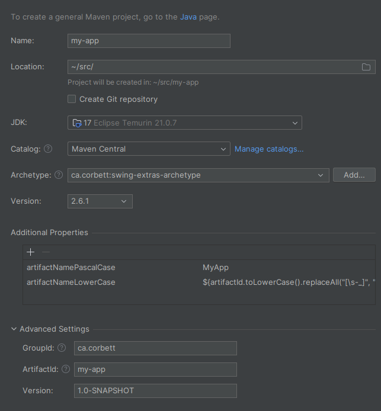

# swing-extras-archetype

## What is this?

This is a Maven archetype project that you can use to very quickly and easily create a new Java Swing
application with application extension support using the `swing-extras` library.

## How do I use this archetype to create my own project?

### Option 1: from the command line

You can use Maven from the command line to generate a new project from this archetype. Run the following command,
replacing the placeholders with your own values:

```bash
mvn archetype:generate \
  -DarchetypeGroupId=ca.corbett \
  -DarchetypeArtifactId=swing-extras-archetype \
  -DarchetypeVersion=2.6.0 \
  -DgroupId=com.example \
  -DartifactId=my-app \
  -Dversion=1.0.0 \
  -DartifactNamePascalCase=MyApp
```

### Option 2: from within an IDE

Most IDEs support creating a new project from a Maven archetype. Let's look at IntelliJ IDEA as an example:

Select **File > New > Project...** and select "Maven Archetype" as the starting point. Now, we can fill
in the details for our new project:



### Required properties

Regardless of which method you use to create your new project, you will need to provide values for the
following properties:

- `groupId`: the group ID for your new project, e.g. `com.example`
- `artifactId`: the artifact ID for your new project, e.g. `my-app`
- `version`: the version for your new project, e.g. `1.0.0`
- `artifactNamePascalCase`: the name of your application in PascalCase, e.g. `MyApp`

### After generating your new project

You should immediately be able to execute a Maven build on your new project:

```bash
cd my-app
mvn clean package
```

This will generate an executable jar file containing your skeletal new project, which
you should be able to run immediately:

```bash
java -jar target/my-app-1.0.0.jar
```

Now, you can go through the code looking for `TODO` comments - these indicate where you should
supply code or information that is specific to your new project. Congratulations! You are up and running.

## What you get out of the box with this archetype

Your skeletal application comes with many `swing-extras` features already wired up and ready to go:

- **SingleInstanceManager is configured and enabled by default.**
    - This prevents multiple instances of your application from running at the same time. If a second instance of your
      application tries to start up, it will detect that the primary instance is already running, and it will exit. But
      first, it will send its command line arguments to your primary instance, so that your primary instance can process
      them. This is handled in the `MainWindow.processStartArgs()` method. Users of your application can disable this by
      disabling the "allow single instance only" option in the Properties dialog, or you can permanently disable this
      for your application by removing the references to the `SingleInstanceManager` class in `Main` (remember to also
      remove the config property).
- **Application extension support.**
    - An `ExtensionManager` implementation class is provided to load and manage application extensions. An example
      built-in TestExtension is provided to demonstrate how to create your own extensions. Basic application extension
      hooks are provided, and can be modified or added to as needed. Refer to
      the [swing-extras documentation](https://www.corbett.ca/swing-extras-book/) for detailed instructions on how to
      create your own extensions.
    - An `ExtensionManagerDialog` class is provided to allow users to manage their installed extensions via a
      simple UI. Users can enable or disable installed extensions, and view information about each extension.
- **Dynamic extension discovery and download support.**
    - If you decide to use [ExtPackager](https://github.com/scorbo2/ext-packager) to distribute and host your
      application
      extensions, all you need to do is drop the `update_sources.json` file into place in your project's root directory,
      and update the `installer.props` file to include it in your installer tarball. That's it! The code will detect its
      existence and supply it to ExtensionManagerDialog automatically, so that your users can discover, download,
      install, uninstall, or upgrade extensions as needed.
- **A skeletal MainWindow is provided.**
    - MainWindow is wired up with a keyboard listener to handle global keyboard shortcuts. You can add new shortcuts in
      the `KeyboardManager` class.
    - MainWindow is wired up with a basic menu bar. You can add new items to the menu in the `MenuManager` class. Note
      that the MenuManager automatically polls for menu items from extensions, so you can add menu items from your
      extensions as well!
    - MainWindow has a `cleanup()` method that is called on application exit. You can add any necessary
      cleanup code there. If you are using `UpdateManager`, this method is automatically registered as a shutdown hook
      so that it will be invoked whenever the application restarts itself to pick up new extensions.
- **Look and Feel support.**
    - The `LookAndFeelManager` class is wired up so that on startup, additional Look and Feels are automatically made
      available to your UI. You can adjust the default value in the `AppConfig` class. Users can change the Look and
      Feel via the Properties dialog, and the UI will automatically reload to reflect the new Look and Feel.
- **Application properties support.**
    - An `AppProperties` implementation called `AppConfig` is provided. Basic configuration properties are provided, and
      you can add more in the `AppConfig.createPropertiesList()` method. Note that extensions are automatically polled
      for configuration properties as well, so you can add configuration properties from your extensions too!
    - There's no need to write a UI for editing your application properties - the `PropertiesDialog` class from
      `swing-extras` provides a complete UI for editing all application properties, including those provided by
      extensions. You just need to add a menu item or button somewhere in your UI to launch the properties dialog, which
      is done for you in the MenuManager class.
    - There's no need to worry about saving or loading your application properties - the `AppProperties` class handles
      that for you automatically.
- **A basic logging setup is provided.**
    - The `java.util.logging` framework is used for logging. Refer to the `Main.configureLogging()` method for details
      on how logging is configured. An example `logging.properties` file is included in the resources.
    - The `LogConsole` class is wired up - this allows your application to launch the LogConsole to view log messages in
      your UI. This is shown in the example main menu in MainWindow, or can be disabled by removing it from
      `logging.properties`.
- **Installer tarball generation is automatic.**
    - If you are building on a linux-based system and you have
      the [make-installer scripts](https://github.com/scorbo2/install-scripts) installed, an installer tarball will be
      automatically generated on each maven build, and placed into the `target` directory.
    - The installer tarball will include a launcher script that sets up proper environment variables for your
      application, along with a desktop icon for easy launching from your desktop environment.
- **Automatic UI reloading.**
    - When the user okays the PropertiesDialog or the ExtensionManagerDialog, the UI is automatically reloaded to
      reflect any changes
      made. The MainWindow is wired up to receive UI reload events, and you can add your additional dialogs or UI
      classes to the notification list by implementing the `UIReloadable` interface adding your UI class as a listener
      to the `UIReloadAction` class.
- **An AboutDialog is automatically generated.**
    - The example main menu in MainWindow shows how to launch the built-in AboutDialog from `swing-extras`. The dialog
      automatically displays information about your application. You can configure what is displayed by adjusting the
      `AboutInfo` instance that is created in the `Version` class.

## What is NOT included in this template

- **Splash progress on startup.**
    - If your application has a lengthy startup, you can optionally use the `SplashProgressWindow` to show a splash
      screen with a progress bar on it during initial load. This is not wired up in this template, but a commented-out
      code example is provided in `Main` to show you how you could do it.
- **Dynamic application extension discovery.**
    - You must use the [ExtPackager](https://github.com/scorbo2/ext-packager) application to generate your version
      manifest and update sources json, and you must upload your extension jars to a web host that you control. This
      template does not directly help you with that, but it does include the code necessary to automatically detect and
      use the update sources json file if you choose to do this.
- **Installer support for platforms other than Linux.**
    - The installer generation scripts only support Linux tarballs at this time. You can of course build and launch the
      application manually on any platform that supports Java, but you will have to create your own installer
      generation scripts for other platforms if you want that functionality.
- **CustomizableDesktopPane for MDI applications.**
    - The example MainWindow does not make use of CustomizableDesktopPane. If your application requires MDI support, you
      can easily add this in yourself by replacing the main content pane of MainWindow with an instance of
      CustomizableDesktopPane, and then adding JInternalFrames to it as needed.

## Documentation and further reading

Refer to the full documentation online:

- Full code for `swing-extras` is [available on GitHub](https://github.com/scorbo2/swing-extras/).
- You can also read through the [swing-extras book](http://www.corbett.ca/swing-extras-book/)
- The [javadocs](http://www.corbett.ca/swing-extras-javadocs/) for `swing-extras` are also available.
- The source code for your generated skeletal project is also heavily commented to help you understand how everything
  fits together.
